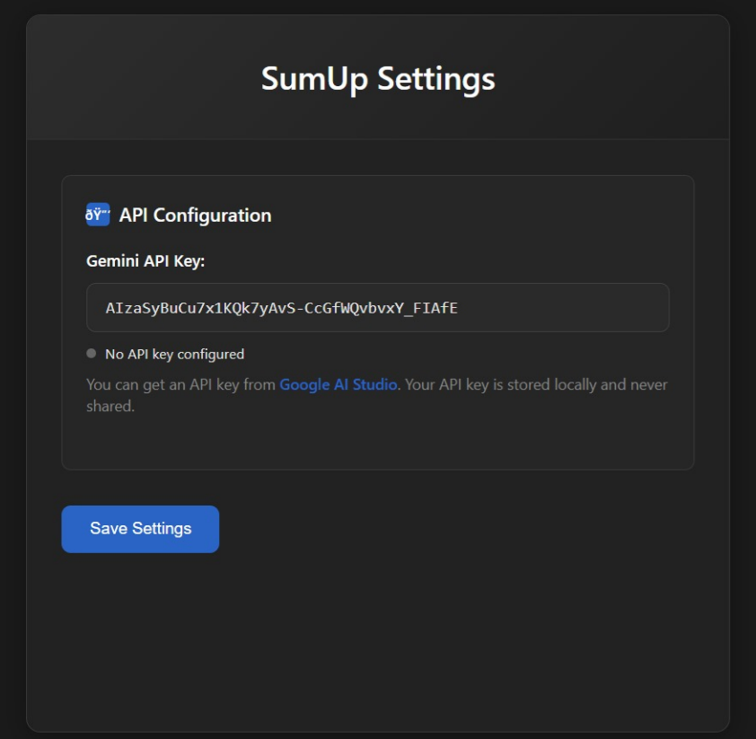
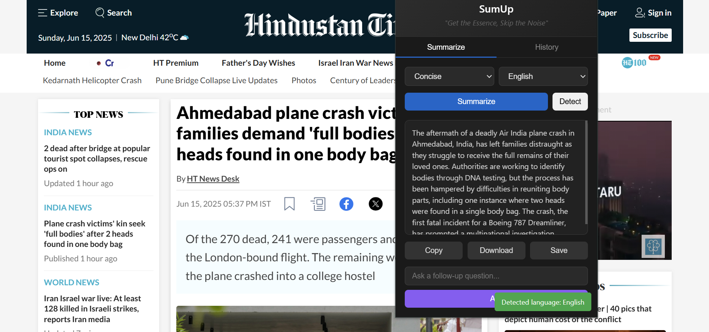
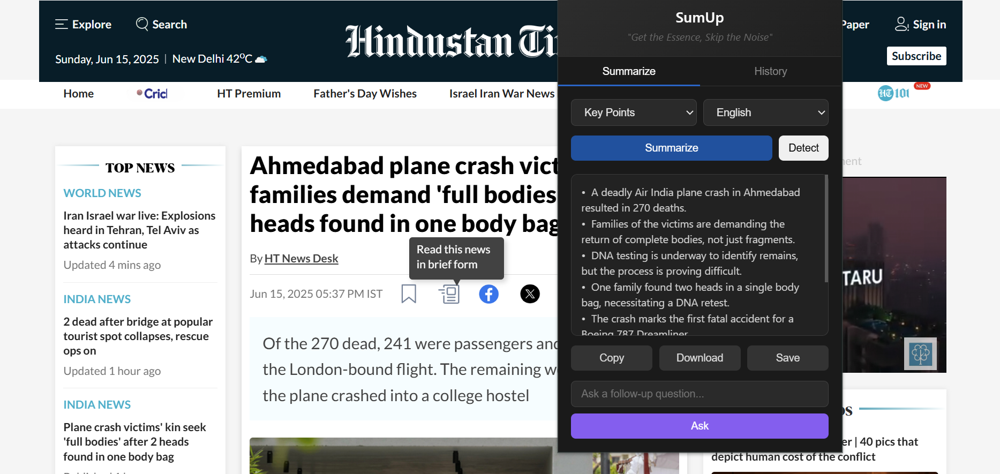
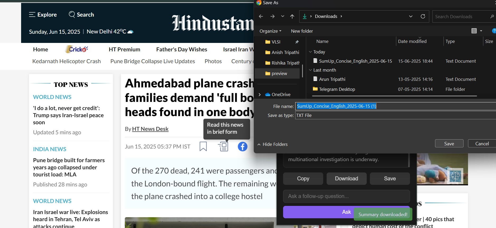
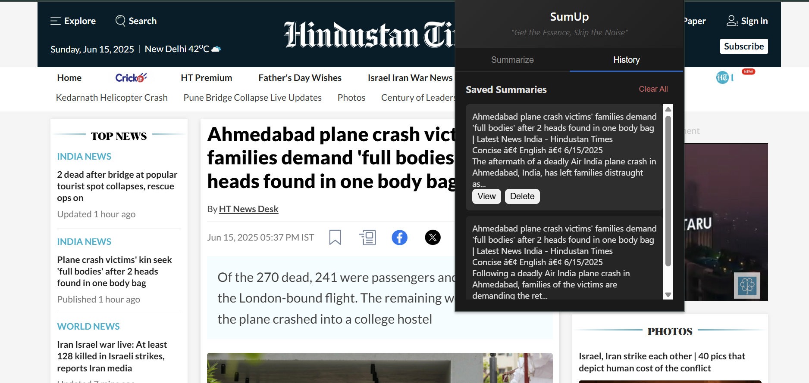
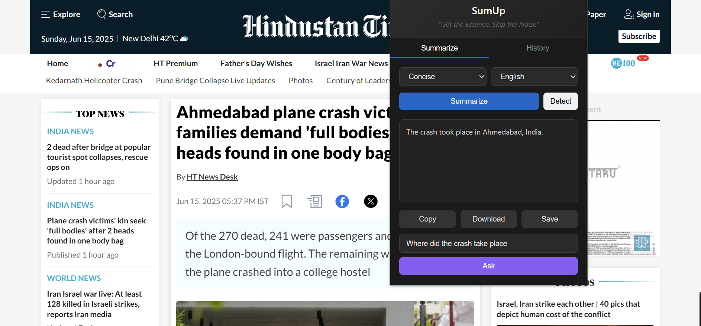

# SumUp: AI-Powered Web Content Summarizer Extension

<div align="center">
  
</div>

<div align="center">

  <h3>AI-Powered Summarizer Chrome Extension</h3>
  <p>SumUp is a smart Chrome extension that uses Google's Gemini API to instantly distill long articles, blogs, and web pages into clear, concise summaries.</p>
</div>


---

## 📋 Table of Contents

- [Features](#-features)
- [Preview](#-preview)  
- [Installation](#-installation)
- [Usage](#-usage)
- [Project Structure](#-project-structure)
- [Configuration](#-configuration)
- [Development](#-development)
- [API Setup](#-api-setup)
- [Contributing](#-contributing)

---

## ✨ Features

### 🧠 **AI-Powered Summarization**
- Powered by Google's Gemini API for accurate and contextual summaries
- Intelligent content extraction from web pages
- Advanced natural language processing

### 📝 **Multiple Summary Modes**
- **Concise**: Quick overview in 5-6 lines
- **In-Depth**: Comprehensive summary with key insights
- **Key Points**: Structured key takeaways


### 🌍 **Multilingual Support**
- English (Default)
- Hindi (हिंदी)
- French (Français)
- Spanish (Español)
- German (Deutsch)
- Portuguese (Português)
- Italian (Italiano)
- Japanese (日本語)

### 🚀 **Smart Features**
- **One-Click Copy**: Instantly copy summaries to clipboard
- **One-Click Download**: Instantly download summaries to file
- **Follow-up Questions**: Ask contextual questions about the content
- **History Tracking**: Save and revisit previous summaries
- **Responsive Design**: Works seamlessly across all devices
- **Privacy-First**: No data stored on external servers

---

## 🖼️ Preview

<details>
  <summary><strong>Click to view the extension</strong></summary>
  <table align="center" style="border-collapse: separate; border-spacing: 20px;">
    <tr>
      <td align="center" style="padding: 15px;">
        
        <div style="margin-top: 10px;"><strong>Extension Popup & Settings</strong></div>
      </td>
      <td align="center" style="padding: 15px;">
        
        <div style="margin-top: 10px;"><strong>In-Depth Summary Mode</strong></div>
      </td>
    </tr>
    <tr>
      <td align="center" style="padding: 15px;">
        
        <div style="margin-top: 10px;"><strong>Concise Summary Mode</strong></div>
      </td>
      <td align="center" style="padding: 15px;">
        
        <div style="margin-top: 10px;"><strong>Key Points Mode</strong></div>
      </td>
    </tr>
    <tr>
      <td align="center" style="padding: 15px;">
        
        <div style="margin-top: 10px;"><strong>Multi-language Translation</strong></div>
      </td>
      <td align="center" style="padding: 15px;">
        
        <div style="margin-top: 10px;"><strong>Download & Save Summary</strong></div>
      </td>
    </tr>
    <tr>
      <td align="center" style="padding: 15px;">
        
        <div style="margin-top: 10px;"><strong>History Tracking</strong></div>
      </td>
      <td align="center" style="padding: 15px;">
        
        <div style="margin-top: 10px;"><strong>Follow-up Questions</strong></div>
      </td>
    </tr>
  </table>
  <p align="center" style="margin-top: 20px;"><em>Smart summary, translation, history, and more</em></p>
</details>


---

## 🚀 Installation

### From Chrome Web Store (Recommended)
1. Visit the [Chrome Web Store](https://chrome.google.com/webstore)
2. Search for "SumUp AI Summarizer"
3. Click "Add to Chrome"
4. Pin the extension to your toolbar

### Manual Installation (Developer Mode)
1. Download or clone this repository
   ```bash
   git clone https://github.com/Anish-Tripathi/SumUp.git
   cd sumup
   ```

2. Open Chrome and navigate to `chrome://extensions/`

3. Enable "Developer mode" (toggle in top-right corner)

4. Click "Load unpacked" and select the project folder

5. The SumUp extension will appear in your extensions list

---

## 🎯 Usage

### Quick Start
1. **Navigate** to any article or blog post
2. **Click** the SumUp extension icon in your toolbar
3. **Choose** your preferred summary mode
4. **Detect** the web ppage language
5. **Select** language (if needed)
6. **Click** "Summarize" and get instant results!

### Advanced Features

#### Summary Modes
- **Brief**: Perfect for quick overviews
- **Detailed**: Comprehensive analysis with context
- **Bullet Points**: Structured takeaways

#### Follow-up Questions
After generating a summary, ask contextual questions like:
- "What are the main benefits mentioned?"
- "Can you explain this concept further?"
- "What are the potential drawbacks?"

#### History Management
- Access previous summaries from the History tab
- Export summaries as text files
- Clear history when needed

---

## 📁 Project Structure

```
sumup/
├── 📄 manifest.json          # Extension configuration
├── 📄 background.js          # Service worker for background tasks
├── 📄 content.js            # Content script for page interaction
├── 📄 popup.html            # Extension popup interface
├── 📄 popup.js              # Popup functionality
├── 📄 options.html          # Settings page
├── 📄 options.js            # Settings functionality
├── 📄 options.css           # Settings styling
├── 📄 popup.css             # Popup styling
├── 📄 package-lock.json     # Dependency lock file
├── 🖼️ icon16.png            # Extension icon (16x16)
├── 🖼️ icon48.png            # Extension icon (48x48)
├── 🖼️ icon128.png           # Extension icon (128x128)
├── 📁 preview/              # Screenshot images
│   ├── sumup-settings.png
│   ├── in-depth-summary.png
│   ├── concise-summary.png
│   ├── key-points.png
│   ├── hindi-translation.png
│   ├── history.png
│   ├── follow-up-questions.png
│   └── mobile-view.png
└── 📄 README.md             # This file
```

### File Descriptions

| File | Purpose |
|------|---------|
| `manifest.json` | Extension metadata and permissions |
| `background.js` | Handles API calls and background processes |
| `content.js` | Extracts content from web pages |
| `popup.html/js/css` | Main extension interface |
| `options.html/js/css` | Settings and configuration page |
| `package-lock.json` | NPM dependencies lock file |

---

## ⚙️ Configuration

### API Setup
1. **Get Gemini API Key**:
   - Visit [Google AI Studio](https://ai.google.dev/)
   - Create a new project or use existing
   - Generate API key

2. **Configure Extension**:
   - Right-click SumUp icon → "Options"
   - Enter your Gemini API key
   - Save settings

### Customization Options
- **Default Language**: Set preferred output language
- **Summary Length**: Default number of lines
- **Auto-Copy**: Automatically copy summaries
- **History Limit**: Maximum saved summaries

---

## 🛠️ Development

### Prerequisites
- Node.js (v14 or higher)
- Chrome browser
- Text editor (VS Code recommended)

### Setup Development Environment
```bash
# Clone repository
git clone https://github.com/Anish-Tripathi/SumUp.git
cd sumup

# Install dependencies (if any)
npm install

# Load extension in Chrome
# 1. Go to chrome://extensions/
# 2. Enable Developer mode
# 3. Click "Load unpacked"
# 4. Select the project folder
```

### Making Changes
1. Edit source files
2. Save changes
3. Click "Reload" on extension card in `chrome://extensions/`
4. Test functionality

### Building for Production
```bash
# Create production build
npm run build

# Create ZIP for Chrome Web Store
npm run package
```

---

## 🔑 API Setup

### Google Gemini API Configuration

1. **Create Google Cloud Project**:
   ```bash
   # Visit: https://console.cloud.google.com/
   # Create new project or select existing
   ```

2. **Enable Gemini API**:
   - Navigate to APIs & Services
   - Enable "Generative Language API"

3. **Generate API Key**:
   - Go to "Credentials" section
   - Create API key
   - Restrict key to Gemini API only

4. **Configure Extension**:
   - Open extension options
   - Enter API key
   - Test connection

### Rate Limits & Costs
- **Free Tier**: 60 requests per minute
- **Paid Plans**: Available for higher usage
- **Cost**: Pay per request based on Google's pricing

---

## 🤝 Contributing

We welcome contributions! Here's how to get started:

### Development Workflow
1. **Fork** the repository
2. **Create** feature branch (`git checkout -b feature/amazing-feature`)
3. **Commit** changes (`git commit -m 'Add amazing feature'`)
4. **Push** to branch (`git push origin feature/amazing-feature`)
5. **Open** Pull Request

### Contribution Guidelines
- Follow existing code style
- Add tests for new features
- Update documentation
- Ensure all tests pass

---


### Frequently Asked Questions

<details>
<summary><strong>How do I get a Gemini API key?</strong></summary>

1. Visit [Google AI Studio](https://ai.google.dev/)
2. Sign in with your Google account
3. Create a new project
4. Generate an API key
5. Copy the key to extension settings
</details>

<details>
<summary><strong>Is my data secure?</strong></summary>

Yes! SumUp processes content locally and only sends text to Google's Gemini API for summarization. No personal data is stored on our servers.
</details>

<details>
<summary><strong>Why isn't the extension working on some websites?</strong></summary>

Some websites block content scripts or have complex layouts. Try refreshing the page or check if the site allows extensions.
</details>

<details>
<summary><strong>Can I use SumUp offline?</strong></summary>

No, SumUp requires an internet connection to communicate with the Gemini API for generating summaries.
</details>

### Changelog

#### Version 1.0.0 (Current)
- ✅ Initial release
- ✅ Gemini API integration
- ✅ Multiple summary modes
- ✅ Multilingual support
- ✅ History tracking
- ✅ Follow-up questions

#### Upcoming Features
- 🔄 PDF summarization
- 🔄 YouTube video summaries
- 🔄 Export to multiple formats
- 🔄 Team collaboration features

---

<div align="center">

### ⭐ Star this repository if you find it helpful!

